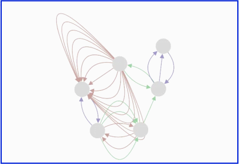

cytoscape-expand-collapse
================================================================================

## Description

This extension provides an interface to expand/collapse nodes and edges for better management of complexity of Cytoscape.js compound graphs, distributed under [The MIT License](https://opensource.org/licenses/MIT).

<p align="center">
  
  &emsp;&emsp;&emsp;&emsp;&emsp;&emsp;&emsp;
  
</p>

Please cite the following paper when using this extension:

U. Dogrusoz , A. Karacelik, I. Safarli, H. Balci, L. Dervishi, and M.C. Siper, "[Efficient methods and readily customizable libraries for managing complexity of large networks](https://doi.org/10.1371/journal.pone.0197238)", PLoS ONE, 13(5): e0197238, 2018.

## Demo

Click [here](http://ivis-at-bilkent.github.io/cytoscape.js-expand-collapse/demo.html) (no undo and with custom cue image) or [here](http://ivis-at-bilkent.github.io/cytoscape.js-expand-collapse/demo-undoable.html) (undoable) or [here](http://ivis-at-bilkent.github.io/cytoscape.js-expand-collapse/demo-compounds-collapsed.html) (compounds initially collapsed) for a demo.
Click [here](http://ivis-at-bilkent.github.io/cytoscape.js-expand-collapse/demo-edges-expand-collapse.html) for undoable edges expand collapse demo.

## API

* Note that compounds are nodes.

`cy.expandCollapse(options)`
To initialize the extension with given options.

`var api = cy.expandCollapse('get')`
To get the extension instance after initialization.

* Following functions get options parameter to apply during a particular event unlike the function above.

`api.collapse(nodes, options)`
Collapse given nodes, extend options with given param.

`api.collapseRecursively(nodes, options)`
Collapse given nodes recursively, extend options with given param.

`api.collapseAll(options)`
Collapse all nodes on graph (recursively), extend options with given param.

`api.expand(nodes, options)`
Expand given nodes, extend options with given param.

`api.expandRecursively(nodes, options)`
Expand given nodes recursively, extend options with given param.

`api.expandAll(options)`
Expand all nodes on graph (recursively), extend options with given param.

`api.isExpandable(node)`
Get whether node is expandable (or is collapsed)

`api.isCollapsible(node)`
Get whether node is collapsible.

`api.expandableNodes(nodes)`
Get expandable ones inside given nodes if nodes parameter is not specified consider all nodes

`api.collapsibleNodes(nodes)`
Get collapsible ones inside given nodes if nodes parameter is not specified consider all nodes

`api.setOptions(options)`
Resets the options to the given parameter.

`api.setOption(name, value)`
Sets the value of the option given by the name to the given value.

`api.extendOptions(options)`
Extend the current options with the given options.

`api.getCollapsedChildren(node)`
Get the children of the given collapsed node which are removed during collapse operation

`api.getCollapsedChildrenRecursively(node)`
Get collapsed children recursively including nested collapsed children. Returned value includes edges and nodes, use selector to get edges or nodes.

`api.getAllCollapsedChildrenRecursively()`
Get collapsed children of all collapsed nodes recursively. Returned value includes edges and nodes, use selector to get edges or nodes.

`api.clearVisualCue()`
Forces the visual cue to be cleared. It is to be called in extreme cases.

`api.enableCue()`
Enable rendering of visual cue.

`api.disableCue()`
Disable rendering of visual cue.

`api.getParent(nodeId)`
Get the parent of a node given its node id. Useful to reach parent of a node removed because of collapse operation.

`api.collapseEdges(edges,options)`
Collapse the given edges if all the given edges are between same two nodes and number of edges passed is at least 2. Does nothing otherwise.

` api.expandEdges(edges){ `
Expand the given collapsed edges

`api.collapseEdgesBetweenNodes(nodes, options)`
Collapse all edges between the set of given nodes. 

`api.expandEdgesBetweenNodes(nodes)`
Expand all collapsed edges between the set of given nodes

`api.collapseAllEdges(options)`
Collapse all edges in the graph.

`api.expandAllEdges()`
Expand all edges in the graph.

## Events
Notice that following events are performed for *each* node that is collapsed/expanded. Also, notice that any post-processing layout is performed *after* the event.

`cy.nodes().on("expandcollapse.beforecollapse", function(event) { var node = this; ... })` Triggered before a node is collapsed

`cy.nodes().on("expandcollapse.aftercollapse", function(event) { var node = this; ... })` Triggered after a node is collapsed

`cy.nodes().on("expandcollapse.beforeexpand", function(event) { var node = this; ... })` Triggered before a node is expanded

`cy.nodes().on("expandcollapse.afterexpand", function(event) { var node = this; ... })`  Triggered after a node is expanded

`cy.edges().on("expandcollapse.beforecollapseedge", function(event) { var edge = this; ... })` Triggered before an edge is collapsed

`cy.edges().on("expandcollapse.aftercollapseedge", function(event) { var edge = this; ... })` Triggered after an edge is collapsed

`cy.edges().on("expandcollapse.beforeexpandedge", function(event) { var edge = this; ... })` Triggered before an edge is expanded

`cy.edges().on("expandcollapse.afterexpandedge", function(event) { var edge = this; ... })`  Triggered after an edge is expanded

All these events can also be listened as [cytoscape.js core events](https://js.cytoscape.org/#cy.on)
e.g. 

`cy.on("expandcollapse.afterexpandedge", function(event) { var elem = event.target; ... })`

## Default Options
```javascript
    var options = {
      layoutBy: null, // to rearrange after expand/collapse. It's just layout options or whole layout function. Choose your side!
      // recommended usage: use cose-bilkent layout with randomize: false to preserve mental map upon expand/collapse
      fisheye: true, // whether to perform fisheye view after expand/collapse you can specify a function too
      animate: true, // whether to animate on drawing changes you can specify a function too
      animationDuration: 1000, // when animate is true, the duration in milliseconds of the animation
      ready: function () { }, // callback when expand/collapse initialized
      undoable: true, // and if undoRedoExtension exists,

      cueEnabled: true, // Whether cues are enabled
      expandCollapseCuePosition: 'top-left', // default cue position is top left you can specify a function per node too
      expandCollapseCueSize: 12, // size of expand-collapse cue
      expandCollapseCueLineSize: 8, // size of lines used for drawing plus-minus icons
      expandCueImage: undefined, // image of expand icon if undefined draw regular expand cue
      collapseCueImage: undefined, // image of collapse icon if undefined draw regular collapse cue
      expandCollapseCueSensitivity: 1, // sensitivity of expand-collapse cues
      edgeTypeInfo: "edgeType", // the name of the field that has the edge type, retrieved from edge.data(), can be a function, if reading the field returns undefined the collapsed edge type will be "unknown"
      groupEdgesOfSameTypeOnCollapse : false, // if true, the edges to be collapsed will be grouped according to their types, and the created collapsed edges will have same type as their group. if false the collapased edge will have "unknown" type.
      allowNestedEdgeCollapse: true, // when you want to collapse a compound edge (edge which contains other edges) and normal edge, should it collapse without expanding the compound first
      zIndex: 999 // z-index value of the canvas in which cue ımages are drawn
    };
```

## Default Undo/Redo Actions
`ur.do("collapse", { nodes: eles, options: opts)` Equivalent of eles.collapse(opts)

`ur.do("expand", { nodes: eles, options: opts)` Equivalent of eles.expand(opts)

`ur.do("collapseRecursively", { nodes: eles, options: opts)` Equivalent of eles.collapseRecursively(opts)

`ur.do("expandRecursively", { nodes: eles, options: opts)` Equivalent of eles.expandRecursively(opts)

`ur.do("collapseAll", { options: opts)` Equivalent of cy.collapseAll(opts)

`ur.do("expandAll", { options: opts })` Equivalent of cy.expandAll(opts)

`ur.do("collapseEdges", { edges: eles, options: opts})` Equivalent of eles.collapseEdges(opts)

`ur.do("expandEdges", { edges: eles})` Equivalent of eles.expandEdges()

`ur.do("collapseEdgesBetweenNodes", { nodes: eles, options: opts})` Equivalent of eles.collapseEdgesBetweenNodes(opts)

`ur.do("expandEdgesBetweenNodes", { nodes: eles})` Equivalent of eles.expandEdgesBetweenNodes()

`ur.do("collapseAllEdges", {options: opts)}` Equivalent of cy.collapseAllEdges(opts)

`ur.do("expandAllEdges")`Equivalent of cy.expandAllEdges()


## Elements Style

 * Collapsed nodes have 'cy-expand-collapse-collapsed-node' class.
 * Meta edges (edges from/to collapsed nodes) have 'cy-expand-collapse-meta-edge' class.
 * Collapsed edges have 'cy-expand-collapse-collapsed-edge' class.
 * Collapsed edges data have 'directionType' field which can be either:
    - 'unidirection' if all the edges that are collapsed into this edge have the same direction (all have same source and same target) 
      or 
    - 'bidirection' if  the edges that are collapsed into this edge have different direction (different target and/or source)
 * Collapsed edges data have a field that holds the type, the field name is as defined in options but if it is not defined in options or was defined as a function it will be named 'edgeType'

 

## Dependencies

 * Cytoscape.js ^3.3.0
 * cytoscape-undo-redo.js(optional) ^1.0.1
 * cytoscape-cose-bilkent.js(optional/suggested for layout after expand/collapse) ^4.0.0


## Usage instructions

Download the library:
 * via npm: `npm install cytoscape-expand-collapse`,
 * via bower: `bower install cytoscape-expand-collapse`, or
 * via direct download in the repository (probably from a tag).

`require()` the library as appropriate for your project:

CommonJS:
```js
var cytoscape = require('cytoscape');
var expandCollapse = require('cytoscape-expand-collapse');

expandCollapse( cytoscape ); // register extension
```

AMD:
```js
require(['cytoscape', 'cytoscape-expand-collapse'], function( cytoscape, expandCollapse ){
  expandCollapse( cytoscape ); // register extension
});
```

Plain HTML/JS has the extension registered for you automatically, because no `require()` is needed.


## Publishing instructions

This project is set up to automatically be published to npm and bower.  To publish:

1. Set the version number environment variable: `export VERSION=1.2.3`
1. Publish: `gulp publish`
1. If publishing to bower for the first time, you'll need to run `bower register cytoscape-expand-collapse https://github.com/iVis-at-Bilkent/cytoscape.js-expand-collapse.git`


## Team

  * [Hasan Balci](https://github.com/hasanbalci), [Nasim Saleh](https://github.com/nasimsaleh), [Ugur Dogrusoz](https://github.com/ugurdogrusoz) of [i-Vis at Bilkent University](http://www.cs.bilkent.edu.tr/~ivis) and [Metin Can Siper](https://github.com/metincansiper) of the Demir Lab at [OHSU](http://www.ohsu.edu/)

## Alumni

  * [Ilkin Safarli](https://github.com/kinimesi), [Alper Karacelik](https://github.com/alperkaracelik), [Selim Firat Yilmaz](https://github.com/mrsfy)
